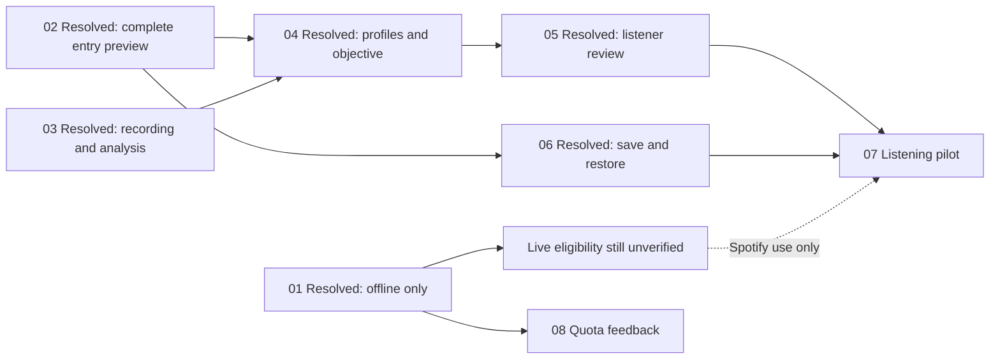

# Better arrangements map

## Notes

The owner requested a product plan based on the supplied playlist-quality discussion. Implementation decisions are delegated; product/design questions should be asked only when necessary. Read the [specification](spec.md) for scope, behavior, objective, checks and release gates.

The application supports Spotify login, automatic analysis, complete previews and protected range-move saves. Ticket 02 keeps fixed entries visible and carries duplicate occurrences independently. Ticket 03 adds conservative recording matching, complete librosa section measurements and versioned caching. Ticket 04 adds Smooth/More variety, a directed objective, bounded search and optional endpoint controls. Ticket 05 adds metadata during analysis, coverage/listening notes, and original/suggested time comparisons. Ticket 06 adds verified save/readback and one-level session restore.

## Decisions-so-far

- Preserve the playlist's complete collection of entries. This is an arranger; selection and recommendations are outside the first release.
- Use recording, playlist entry, transition, listening profile and preview as defined in [CONTEXT.md](../../CONTEXT.md).
- Carry complete occurrence identities throughout the flow. The accepted [ADR](../../docs/adr/0001-arrange-playlist-entries.md) records why track IDs alone are insufficient.
- Prefer existing UI and save safeguards. Replace faulty custom audio routines with librosa rather than extending them.
- Treat the objective weights and matching thresholds as testable initial settings, not research-backed constants.
- Determine live source/API feasibility separately from offline implementation. No live writes or messages are part of this planning task.
- Ticket 01 is resolved with an **offline-only** research outcome. Spotipy 2.26.0 already implements the needed current endpoints and fields; no SDK migration is required. The [research report](../../docs/audio-source-feasibility.md) records primary sources, sanitized local configuration evidence and the passing mocked-transport probe. This does not clear a live pilot.
- [Ticket 08](issues/08-spotify-quota-feedback.md) captures the observed gap in explanations for Spotify rate limits and exhausted quota. Automatic retries for moves remain disabled.
- [Ticket 02](issues/02-complete-entry-preview.md) is resolved. Preview and save share the same complete occurrence order; fixed items show reasons, uncertain boundaries remain unassessed, and repeated saves preserve the chosen duplicate. Seven offline tests, the full repository check, the SDK probe and keyboard/light/dark/mobile browser checks pass. No live integration was exercised.
- [Ticket 03](issues/03-recording-analysis.md) is resolved. Librosa 1.0.0 measures complete bounded recordings with per-measurement evidence; matching rejects uncertain candidates, duplicate occurrences share work, and raw caches have versions/source evidence/atomic checkpoints. Fourteen offline tests and repository/browser checks pass. The [benchmark report](../../docs/librosa-analysis-research.md#implemented-extraction-and-measured-limits) records a 535.8 MiB peak on a generated twenty-minute file. This does not establish live latency, source permission or listening preference.
- [Ticket 04](issues/04-arrangement-objective.md) is resolved. Smooth and More variety use shared directed section costs and bounded artist/monotony penalties, preserve all entries and optional endpoints, and cannot exceed the feasible-original cost. Basic controls cover conflicts and unchanged/identical results. Twenty-one offline tests and repository/browser checks pass. The [500-entry benchmark](../../docs/arrangement-benchmarks.md) took 0.28756 s for Smooth with preparation and 0.20141 s for More variety with reused matrices. Listening preference remains untested.
- [Ticket 05](issues/05-listener-review.md) is resolved. Complete metadata/progress remain visible through checking and interruption; review separates completion from usable evidence, limits listening notes to three, and compares both orders over full entry durations with text alternatives. Twenty-four offline tests, native timeline checks and keyboard/theme/narrow browser checks pass. The graph assumes full playback without crossfade; missing durations disable it. Listening preference remains untested.

- [Ticket 06](issues/06-save-and-restore.md) is resolved. Save and restore verify every page between matching snapshots, preserve one pre-save occurrence order, and stop on stale or uncertain results. The screen labels verified/restored orders and explains the session limit. Thirty-one offline tests, the full repository check, and keyboard/theme/narrow/axe browser checks pass. Spotify activity was mocked; live integration and listening remain unverified.

- The owner prioritized a reported uncertainty/speed problem after ticket 06. [The follow-up](../faster-recording-checks/issues/01-pipeline-and-youtube-access.md) is resolved with bounded source extraction, stronger structured matching, optional cookies and clearer failures. Forty offline tests, browser checks and the offline container runtime check pass. The listening pilot still needs real evidence.

- The owner explicitly requested best-effort source selection and live retries for Pump Mix. [Follow-up 02](../faster-recording-checks/issues/02-best-effort-matches.md) is resolved: 130/130 entries now analyzed versus 0/130 initially, using anonymous YouTube access. No Spotify order was changed. Forty-four offline tests pass; successful analysis is not proof of exact recording identity or listening preference.

## Fog

| Product branch | Asked | Draft default | Effect of another answer |
| --- | --- | --- | --- |
| Main listening experience | Everyday flow, a deliberate journey, or an activity? | Everyday flow | Journey moves its time-based objective into the first release; an activity needs only a follow-up about the intended session |
| First audience | Owner/invited listeners or a public product? | Owner and a few invited listeners | Public scope moves access approval, hosting, persistent work and self-service onboarding into launch requirements |

These questions remain unanswered as of this draft. The defaults are proposals, not attributed user decisions. No additional product question is needed to review this plan. If the defaults stand, the technical tickets can proceed subject to their listed dependencies; public deployment and live testing are separate work.

The installed SDK's request and parser contracts are verified offline. Actual app quota mode, Premium/allowlist status, dashboard callback, account access and source/integration permission remain unverified. Ticket 01's offline-only outcome means a live integrated pilot is still ineligible until those external facts are established. No authorized real-recording corpus was supplied. Generated audio and invented metadata can support engineering now; a separately authorized corpus is needed for listening. Ticket 03 measures analysis and ticket 07 tests listening preference.

## Work order

The next frontier is **07, Test whether listeners prefer the arrangements**. Dependencies 04, 05 and 06 are resolved, but it remains `needs-info`: authorized real recordings and listener observations have not been supplied. Integrated live source use also remains unverified. Ticket 08, Spotify quota feedback, is ready for independent engineering work. Select the first numbered unresolved, unblocked, unclaimed ticket and claim it before implementation; do not resolve the listening pilot with generated audio or optimizer scores.
